# Ruby public graphics

This page is generated from the repository's verified `graphics/` tree. Japanese and Korean assets are listed before English and other official languages.

## Header

| Preview | File | Language | Size | SHA-256 |
| --- | --- | --- | --- | --- |
|  | [`graphics/header/nintendo-logo-jp.png`](graphics/header/nintendo-logo-jp.png) | Japanese | 416x64 | `f07daf6e489d64b7...` |

## Pokemon

| Preview | File | Language | Size | SHA-256 |
| --- | --- | --- | --- | --- |
|  | [`graphics/pokemon/blastoise-back-rev0-jp.png`](graphics/pokemon/blastoise-back-rev0-jp.png) | Japanese | 128x128 | `023258b041aca5b0...` |
|  | [`graphics/pokemon/blastoise-front-rev0-jp.png`](graphics/pokemon/blastoise-front-rev0-jp.png) | Japanese | 128x128 | `d42812517389bf5d...` |
| 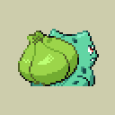 | [`graphics/pokemon/bulbasaur-back-rev0-jp.png`](graphics/pokemon/bulbasaur-back-rev0-jp.png) | Japanese | 128x128 | `a56ef8e9a9b690fc...` |
| 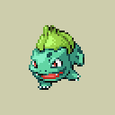 | [`graphics/pokemon/bulbasaur-front-rev0-jp.png`](graphics/pokemon/bulbasaur-front-rev0-jp.png) | Japanese | 128x128 | `8a325c6541282fa7...` |
|  | [`graphics/pokemon/butterfree-back-rev0-jp.png`](graphics/pokemon/butterfree-back-rev0-jp.png) | Japanese | 128x128 | `1b00ee385be0beef...` |
|  | [`graphics/pokemon/butterfree-front-rev0-jp.png`](graphics/pokemon/butterfree-front-rev0-jp.png) | Japanese | 128x128 | `b983f495975ce890...` |
|  | [`graphics/pokemon/caterpie-back-rev0-jp.png`](graphics/pokemon/caterpie-back-rev0-jp.png) | Japanese | 128x128 | `925ae814b8fed35b...` |
|  | [`graphics/pokemon/caterpie-front-rev0-jp.png`](graphics/pokemon/caterpie-front-rev0-jp.png) | Japanese | 128x128 | `41316760a707eea2...` |
|  | [`graphics/pokemon/charizard-back-rev0-jp.png`](graphics/pokemon/charizard-back-rev0-jp.png) | Japanese | 128x128 | `3d0a42b79e5f9b53...` |
|  | [`graphics/pokemon/charizard-front-rev0-jp.png`](graphics/pokemon/charizard-front-rev0-jp.png) | Japanese | 128x128 | `797b28665827c19e...` |
| 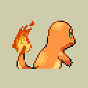 | [`graphics/pokemon/charmander-back-rev0-jp.png`](graphics/pokemon/charmander-back-rev0-jp.png) | Japanese | 128x128 | `0521ce266d4c527f...` |
|  | [`graphics/pokemon/charmander-front-rev0-jp.png`](graphics/pokemon/charmander-front-rev0-jp.png) | Japanese | 128x128 | `c2521fd7f5d54944...` |
|  | [`graphics/pokemon/charmeleon-back-rev0-jp.png`](graphics/pokemon/charmeleon-back-rev0-jp.png) | Japanese | 128x128 | `930bd0b4b2900d41...` |
|  | [`graphics/pokemon/charmeleon-front-rev0-jp.png`](graphics/pokemon/charmeleon-front-rev0-jp.png) | Japanese | 128x128 | `81a6fbf60b8bfd50...` |
| 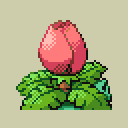 | [`graphics/pokemon/ivysaur-back-rev0-jp.png`](graphics/pokemon/ivysaur-back-rev0-jp.png) | Japanese | 128x128 | `57f839867dfb4f04...` |
| 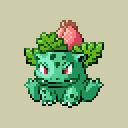 | [`graphics/pokemon/ivysaur-front-rev0-jp.png`](graphics/pokemon/ivysaur-front-rev0-jp.png) | Japanese | 128x128 | `317ca13389c4a268...` |
|  | [`graphics/pokemon/metapod-back-rev0-jp.png`](graphics/pokemon/metapod-back-rev0-jp.png) | Japanese | 128x128 | `8395dde11cc411d5...` |
| 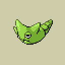 | [`graphics/pokemon/metapod-front-rev0-jp.png`](graphics/pokemon/metapod-front-rev0-jp.png) | Japanese | 128x128 | `d256a09933b47d5c...` |
|  | [`graphics/pokemon/pikachu-back-rev0-jp.png`](graphics/pokemon/pikachu-back-rev0-jp.png) | Japanese | 128x128 | `d1472dd2f4862fe9...` |
|  | [`graphics/pokemon/pikachu-front-rev0-jp.png`](graphics/pokemon/pikachu-front-rev0-jp.png) | Japanese | 128x128 | `0be25ad9c369dfb5...` |
|  | [`graphics/pokemon/squirtle-back-rev0-jp.png`](graphics/pokemon/squirtle-back-rev0-jp.png) | Japanese | 128x128 | `c80710c9b72dc8c6...` |
|  | [`graphics/pokemon/squirtle-front-rev0-jp.png`](graphics/pokemon/squirtle-front-rev0-jp.png) | Japanese | 128x128 | `867c957520288232...` |
| 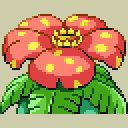 | [`graphics/pokemon/venusaur-back-rev0-jp.png`](graphics/pokemon/venusaur-back-rev0-jp.png) | Japanese | 128x128 | `8467656ef54308b2...` |
| 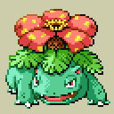 | [`graphics/pokemon/venusaur-front-rev0-jp.png`](graphics/pokemon/venusaur-front-rev0-jp.png) | Japanese | 128x128 | `9c6f9fdb302031aa...` |
|  | [`graphics/pokemon/wartortle-back-rev0-jp.png`](graphics/pokemon/wartortle-back-rev0-jp.png) | Japanese | 128x128 | `8942792e813fb742...` |
|  | [`graphics/pokemon/wartortle-front-rev0-jp.png`](graphics/pokemon/wartortle-front-rev0-jp.png) | Japanese | 128x128 | `b1cfdce661ac366e...` |
|  | [`graphics/pokemon/blastoise-back-rev0-en.png`](graphics/pokemon/blastoise-back-rev0-en.png) | English | 128x128 | `023258b041aca5b0...` |
|  | [`graphics/pokemon/blastoise-back-rev1-en.png`](graphics/pokemon/blastoise-back-rev1-en.png) | English | 128x128 | `023258b041aca5b0...` |
|  | [`graphics/pokemon/blastoise-back-rev2-en.png`](graphics/pokemon/blastoise-back-rev2-en.png) | English | 128x128 | `023258b041aca5b0...` |
|  | [`graphics/pokemon/blastoise-front-rev0-en.png`](graphics/pokemon/blastoise-front-rev0-en.png) | English | 128x128 | `d42812517389bf5d...` |
|  | [`graphics/pokemon/blastoise-front-rev1-en.png`](graphics/pokemon/blastoise-front-rev1-en.png) | English | 128x128 | `d42812517389bf5d...` |
|  | [`graphics/pokemon/blastoise-front-rev2-en.png`](graphics/pokemon/blastoise-front-rev2-en.png) | English | 128x128 | `d42812517389bf5d...` |
|  | [`graphics/pokemon/bulbasaur-back-rev0-en.png`](graphics/pokemon/bulbasaur-back-rev0-en.png) | English | 128x128 | `a56ef8e9a9b690fc...` |
|  | [`graphics/pokemon/bulbasaur-back-rev1-en.png`](graphics/pokemon/bulbasaur-back-rev1-en.png) | English | 128x128 | `a56ef8e9a9b690fc...` |
|  | [`graphics/pokemon/bulbasaur-back-rev2-en.png`](graphics/pokemon/bulbasaur-back-rev2-en.png) | English | 128x128 | `a56ef8e9a9b690fc...` |
|  | [`graphics/pokemon/bulbasaur-front-rev0-en.png`](graphics/pokemon/bulbasaur-front-rev0-en.png) | English | 128x128 | `8a325c6541282fa7...` |
|  | [`graphics/pokemon/bulbasaur-front-rev1-en.png`](graphics/pokemon/bulbasaur-front-rev1-en.png) | English | 128x128 | `8a325c6541282fa7...` |
|  | [`graphics/pokemon/bulbasaur-front-rev2-en.png`](graphics/pokemon/bulbasaur-front-rev2-en.png) | English | 128x128 | `8a325c6541282fa7...` |
|  | [`graphics/pokemon/butterfree-back-rev0-en.png`](graphics/pokemon/butterfree-back-rev0-en.png) | English | 128x128 | `1b00ee385be0beef...` |
|  | [`graphics/pokemon/butterfree-back-rev1-en.png`](graphics/pokemon/butterfree-back-rev1-en.png) | English | 128x128 | `1b00ee385be0beef...` |
|  | [`graphics/pokemon/butterfree-back-rev2-en.png`](graphics/pokemon/butterfree-back-rev2-en.png) | English | 128x128 | `1b00ee385be0beef...` |
|  | [`graphics/pokemon/butterfree-front-rev0-en.png`](graphics/pokemon/butterfree-front-rev0-en.png) | English | 128x128 | `b983f495975ce890...` |
|  | [`graphics/pokemon/butterfree-front-rev1-en.png`](graphics/pokemon/butterfree-front-rev1-en.png) | English | 128x128 | `b983f495975ce890...` |
|  | [`graphics/pokemon/butterfree-front-rev2-en.png`](graphics/pokemon/butterfree-front-rev2-en.png) | English | 128x128 | `b983f495975ce890...` |
|  | [`graphics/pokemon/caterpie-back-rev0-en.png`](graphics/pokemon/caterpie-back-rev0-en.png) | English | 128x128 | `925ae814b8fed35b...` |
|  | [`graphics/pokemon/caterpie-back-rev1-en.png`](graphics/pokemon/caterpie-back-rev1-en.png) | English | 128x128 | `925ae814b8fed35b...` |
|  | [`graphics/pokemon/caterpie-back-rev2-en.png`](graphics/pokemon/caterpie-back-rev2-en.png) | English | 128x128 | `925ae814b8fed35b...` |
|  | [`graphics/pokemon/caterpie-front-rev0-en.png`](graphics/pokemon/caterpie-front-rev0-en.png) | English | 128x128 | `41316760a707eea2...` |
|  | [`graphics/pokemon/caterpie-front-rev1-en.png`](graphics/pokemon/caterpie-front-rev1-en.png) | English | 128x128 | `41316760a707eea2...` |
|  | [`graphics/pokemon/caterpie-front-rev2-en.png`](graphics/pokemon/caterpie-front-rev2-en.png) | English | 128x128 | `41316760a707eea2...` |
| 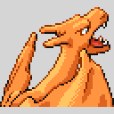 | [`graphics/pokemon/charizard-back-rev0-en.png`](graphics/pokemon/charizard-back-rev0-en.png) | English | 128x128 | `3d0a42b79e5f9b53...` |
|  | [`graphics/pokemon/charizard-back-rev1-en.png`](graphics/pokemon/charizard-back-rev1-en.png) | English | 128x128 | `3d0a42b79e5f9b53...` |
|  | [`graphics/pokemon/charizard-back-rev2-en.png`](graphics/pokemon/charizard-back-rev2-en.png) | English | 128x128 | `3d0a42b79e5f9b53...` |
|  | [`graphics/pokemon/charizard-front-rev0-en.png`](graphics/pokemon/charizard-front-rev0-en.png) | English | 128x128 | `797b28665827c19e...` |
|  | [`graphics/pokemon/charizard-front-rev1-en.png`](graphics/pokemon/charizard-front-rev1-en.png) | English | 128x128 | `797b28665827c19e...` |
|  | [`graphics/pokemon/charizard-front-rev2-en.png`](graphics/pokemon/charizard-front-rev2-en.png) | English | 128x128 | `797b28665827c19e...` |
|  | [`graphics/pokemon/charmander-back-rev0-en.png`](graphics/pokemon/charmander-back-rev0-en.png) | English | 128x128 | `0521ce266d4c527f...` |
|  | [`graphics/pokemon/charmander-back-rev1-en.png`](graphics/pokemon/charmander-back-rev1-en.png) | English | 128x128 | `0521ce266d4c527f...` |
|  | [`graphics/pokemon/charmander-back-rev2-en.png`](graphics/pokemon/charmander-back-rev2-en.png) | English | 128x128 | `0521ce266d4c527f...` |
|  | [`graphics/pokemon/charmander-front-rev0-en.png`](graphics/pokemon/charmander-front-rev0-en.png) | English | 128x128 | `c2521fd7f5d54944...` |
|  | [`graphics/pokemon/charmander-front-rev1-en.png`](graphics/pokemon/charmander-front-rev1-en.png) | English | 128x128 | `c2521fd7f5d54944...` |
|  | [`graphics/pokemon/charmander-front-rev2-en.png`](graphics/pokemon/charmander-front-rev2-en.png) | English | 128x128 | `c2521fd7f5d54944...` |
|  | [`graphics/pokemon/charmeleon-back-rev0-en.png`](graphics/pokemon/charmeleon-back-rev0-en.png) | English | 128x128 | `930bd0b4b2900d41...` |
|  | [`graphics/pokemon/charmeleon-back-rev1-en.png`](graphics/pokemon/charmeleon-back-rev1-en.png) | English | 128x128 | `930bd0b4b2900d41...` |
|  | [`graphics/pokemon/charmeleon-back-rev2-en.png`](graphics/pokemon/charmeleon-back-rev2-en.png) | English | 128x128 | `930bd0b4b2900d41...` |
| 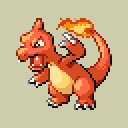 | [`graphics/pokemon/charmeleon-front-rev0-en.png`](graphics/pokemon/charmeleon-front-rev0-en.png) | English | 128x128 | `81a6fbf60b8bfd50...` |
|  | [`graphics/pokemon/charmeleon-front-rev1-en.png`](graphics/pokemon/charmeleon-front-rev1-en.png) | English | 128x128 | `81a6fbf60b8bfd50...` |
|  | [`graphics/pokemon/charmeleon-front-rev2-en.png`](graphics/pokemon/charmeleon-front-rev2-en.png) | English | 128x128 | `81a6fbf60b8bfd50...` |
|  | [`graphics/pokemon/ivysaur-back-rev0-en.png`](graphics/pokemon/ivysaur-back-rev0-en.png) | English | 128x128 | `57f839867dfb4f04...` |
|  | [`graphics/pokemon/ivysaur-back-rev1-en.png`](graphics/pokemon/ivysaur-back-rev1-en.png) | English | 128x128 | `57f839867dfb4f04...` |
|  | [`graphics/pokemon/ivysaur-back-rev2-en.png`](graphics/pokemon/ivysaur-back-rev2-en.png) | English | 128x128 | `57f839867dfb4f04...` |
|  | [`graphics/pokemon/ivysaur-front-rev0-en.png`](graphics/pokemon/ivysaur-front-rev0-en.png) | English | 128x128 | `317ca13389c4a268...` |
|  | [`graphics/pokemon/ivysaur-front-rev1-en.png`](graphics/pokemon/ivysaur-front-rev1-en.png) | English | 128x128 | `317ca13389c4a268...` |
|  | [`graphics/pokemon/ivysaur-front-rev2-en.png`](graphics/pokemon/ivysaur-front-rev2-en.png) | English | 128x128 | `317ca13389c4a268...` |
| 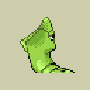 | [`graphics/pokemon/metapod-back-rev0-en.png`](graphics/pokemon/metapod-back-rev0-en.png) | English | 128x128 | `8395dde11cc411d5...` |
|  | [`graphics/pokemon/metapod-back-rev1-en.png`](graphics/pokemon/metapod-back-rev1-en.png) | English | 128x128 | `8395dde11cc411d5...` |
|  | [`graphics/pokemon/metapod-back-rev2-en.png`](graphics/pokemon/metapod-back-rev2-en.png) | English | 128x128 | `8395dde11cc411d5...` |
|  | [`graphics/pokemon/metapod-front-rev0-en.png`](graphics/pokemon/metapod-front-rev0-en.png) | English | 128x128 | `d256a09933b47d5c...` |
|  | [`graphics/pokemon/metapod-front-rev1-en.png`](graphics/pokemon/metapod-front-rev1-en.png) | English | 128x128 | `d256a09933b47d5c...` |
|  | [`graphics/pokemon/metapod-front-rev2-en.png`](graphics/pokemon/metapod-front-rev2-en.png) | English | 128x128 | `d256a09933b47d5c...` |
|  | [`graphics/pokemon/pikachu-back-rev0-en.png`](graphics/pokemon/pikachu-back-rev0-en.png) | English | 128x128 | `d1472dd2f4862fe9...` |
|  | [`graphics/pokemon/pikachu-back-rev1-en.png`](graphics/pokemon/pikachu-back-rev1-en.png) | English | 128x128 | `d1472dd2f4862fe9...` |
|  | [`graphics/pokemon/pikachu-back-rev2-en.png`](graphics/pokemon/pikachu-back-rev2-en.png) | English | 128x128 | `d1472dd2f4862fe9...` |
|  | [`graphics/pokemon/pikachu-front-rev0-en.png`](graphics/pokemon/pikachu-front-rev0-en.png) | English | 128x128 | `0be25ad9c369dfb5...` |
|  | [`graphics/pokemon/pikachu-front-rev1-en.png`](graphics/pokemon/pikachu-front-rev1-en.png) | English | 128x128 | `0be25ad9c369dfb5...` |
|  | [`graphics/pokemon/pikachu-front-rev2-en.png`](graphics/pokemon/pikachu-front-rev2-en.png) | English | 128x128 | `0be25ad9c369dfb5...` |
|  | [`graphics/pokemon/squirtle-back-rev0-en.png`](graphics/pokemon/squirtle-back-rev0-en.png) | English | 128x128 | `c80710c9b72dc8c6...` |
|  | [`graphics/pokemon/squirtle-back-rev1-en.png`](graphics/pokemon/squirtle-back-rev1-en.png) | English | 128x128 | `c80710c9b72dc8c6...` |
|  | [`graphics/pokemon/squirtle-back-rev2-en.png`](graphics/pokemon/squirtle-back-rev2-en.png) | English | 128x128 | `c80710c9b72dc8c6...` |
|  | [`graphics/pokemon/squirtle-front-rev0-en.png`](graphics/pokemon/squirtle-front-rev0-en.png) | English | 128x128 | `867c957520288232...` |
|  | [`graphics/pokemon/squirtle-front-rev1-en.png`](graphics/pokemon/squirtle-front-rev1-en.png) | English | 128x128 | `867c957520288232...` |
|  | [`graphics/pokemon/squirtle-front-rev2-en.png`](graphics/pokemon/squirtle-front-rev2-en.png) | English | 128x128 | `867c957520288232...` |
|  | [`graphics/pokemon/venusaur-back-rev0-en.png`](graphics/pokemon/venusaur-back-rev0-en.png) | English | 128x128 | `8467656ef54308b2...` |
|  | [`graphics/pokemon/venusaur-back-rev1-en.png`](graphics/pokemon/venusaur-back-rev1-en.png) | English | 128x128 | `8467656ef54308b2...` |
|  | [`graphics/pokemon/venusaur-back-rev2-en.png`](graphics/pokemon/venusaur-back-rev2-en.png) | English | 128x128 | `8467656ef54308b2...` |
|  | [`graphics/pokemon/venusaur-front-rev0-en.png`](graphics/pokemon/venusaur-front-rev0-en.png) | English | 128x128 | `9c6f9fdb302031aa...` |
|  | [`graphics/pokemon/venusaur-front-rev1-en.png`](graphics/pokemon/venusaur-front-rev1-en.png) | English | 128x128 | `9c6f9fdb302031aa...` |
|  | [`graphics/pokemon/venusaur-front-rev2-en.png`](graphics/pokemon/venusaur-front-rev2-en.png) | English | 128x128 | `9c6f9fdb302031aa...` |
|  | [`graphics/pokemon/wartortle-back-rev0-en.png`](graphics/pokemon/wartortle-back-rev0-en.png) | English | 128x128 | `8942792e813fb742...` |
|  | [`graphics/pokemon/wartortle-back-rev1-en.png`](graphics/pokemon/wartortle-back-rev1-en.png) | English | 128x128 | `8942792e813fb742...` |
|  | [`graphics/pokemon/wartortle-back-rev2-en.png`](graphics/pokemon/wartortle-back-rev2-en.png) | English | 128x128 | `8942792e813fb742...` |
|  | [`graphics/pokemon/wartortle-front-rev0-en.png`](graphics/pokemon/wartortle-front-rev0-en.png) | English | 128x128 | `b1cfdce661ac366e...` |
|  | [`graphics/pokemon/wartortle-front-rev1-en.png`](graphics/pokemon/wartortle-front-rev1-en.png) | English | 128x128 | `b1cfdce661ac366e...` |
|  | [`graphics/pokemon/wartortle-front-rev2-en.png`](graphics/pokemon/wartortle-front-rev2-en.png) | English | 128x128 | `b1cfdce661ac366e...` |
|  | [`graphics/pokemon/blastoise-back-rev0-de.png`](graphics/pokemon/blastoise-back-rev0-de.png) | German | 128x128 | `023258b041aca5b0...` |
|  | [`graphics/pokemon/blastoise-back-rev0-debug-de.png`](graphics/pokemon/blastoise-back-rev0-debug-de.png) | German | 128x128 | `023258b041aca5b0...` |
|  | [`graphics/pokemon/blastoise-back-rev1-de.png`](graphics/pokemon/blastoise-back-rev1-de.png) | German | 128x128 | `023258b041aca5b0...` |
|  | [`graphics/pokemon/blastoise-front-rev0-de.png`](graphics/pokemon/blastoise-front-rev0-de.png) | German | 128x128 | `d42812517389bf5d...` |
|  | [`graphics/pokemon/blastoise-front-rev0-debug-de.png`](graphics/pokemon/blastoise-front-rev0-debug-de.png) | German | 128x128 | `d42812517389bf5d...` |
|  | [`graphics/pokemon/blastoise-front-rev1-de.png`](graphics/pokemon/blastoise-front-rev1-de.png) | German | 128x128 | `d42812517389bf5d...` |
|  | [`graphics/pokemon/bulbasaur-back-rev0-de.png`](graphics/pokemon/bulbasaur-back-rev0-de.png) | German | 128x128 | `a56ef8e9a9b690fc...` |
|  | [`graphics/pokemon/bulbasaur-back-rev0-debug-de.png`](graphics/pokemon/bulbasaur-back-rev0-debug-de.png) | German | 128x128 | `a56ef8e9a9b690fc...` |
|  | [`graphics/pokemon/bulbasaur-back-rev1-de.png`](graphics/pokemon/bulbasaur-back-rev1-de.png) | German | 128x128 | `a56ef8e9a9b690fc...` |
|  | [`graphics/pokemon/bulbasaur-front-rev0-de.png`](graphics/pokemon/bulbasaur-front-rev0-de.png) | German | 128x128 | `8a325c6541282fa7...` |
|  | [`graphics/pokemon/bulbasaur-front-rev0-debug-de.png`](graphics/pokemon/bulbasaur-front-rev0-debug-de.png) | German | 128x128 | `8a325c6541282fa7...` |
|  | [`graphics/pokemon/bulbasaur-front-rev1-de.png`](graphics/pokemon/bulbasaur-front-rev1-de.png) | German | 128x128 | `8a325c6541282fa7...` |
|  | [`graphics/pokemon/butterfree-back-rev0-de.png`](graphics/pokemon/butterfree-back-rev0-de.png) | German | 128x128 | `1b00ee385be0beef...` |
|  | [`graphics/pokemon/butterfree-back-rev0-debug-de.png`](graphics/pokemon/butterfree-back-rev0-debug-de.png) | German | 128x128 | `1b00ee385be0beef...` |
|  | [`graphics/pokemon/butterfree-back-rev1-de.png`](graphics/pokemon/butterfree-back-rev1-de.png) | German | 128x128 | `1b00ee385be0beef...` |
|  | [`graphics/pokemon/butterfree-front-rev0-de.png`](graphics/pokemon/butterfree-front-rev0-de.png) | German | 128x128 | `b983f495975ce890...` |
|  | [`graphics/pokemon/butterfree-front-rev0-debug-de.png`](graphics/pokemon/butterfree-front-rev0-debug-de.png) | German | 128x128 | `b983f495975ce890...` |
|  | [`graphics/pokemon/butterfree-front-rev1-de.png`](graphics/pokemon/butterfree-front-rev1-de.png) | German | 128x128 | `b983f495975ce890...` |
|  | [`graphics/pokemon/caterpie-back-rev0-de.png`](graphics/pokemon/caterpie-back-rev0-de.png) | German | 128x128 | `925ae814b8fed35b...` |
|  | [`graphics/pokemon/caterpie-back-rev0-debug-de.png`](graphics/pokemon/caterpie-back-rev0-debug-de.png) | German | 128x128 | `925ae814b8fed35b...` |
|  | [`graphics/pokemon/caterpie-back-rev1-de.png`](graphics/pokemon/caterpie-back-rev1-de.png) | German | 128x128 | `925ae814b8fed35b...` |
|  | [`graphics/pokemon/caterpie-front-rev0-de.png`](graphics/pokemon/caterpie-front-rev0-de.png) | German | 128x128 | `41316760a707eea2...` |
|  | [`graphics/pokemon/caterpie-front-rev0-debug-de.png`](graphics/pokemon/caterpie-front-rev0-debug-de.png) | German | 128x128 | `41316760a707eea2...` |
|  | [`graphics/pokemon/caterpie-front-rev1-de.png`](graphics/pokemon/caterpie-front-rev1-de.png) | German | 128x128 | `41316760a707eea2...` |
|  | [`graphics/pokemon/charizard-back-rev0-de.png`](graphics/pokemon/charizard-back-rev0-de.png) | German | 128x128 | `3d0a42b79e5f9b53...` |
|  | [`graphics/pokemon/charizard-back-rev0-debug-de.png`](graphics/pokemon/charizard-back-rev0-debug-de.png) | German | 128x128 | `3d0a42b79e5f9b53...` |
|  | [`graphics/pokemon/charizard-back-rev1-de.png`](graphics/pokemon/charizard-back-rev1-de.png) | German | 128x128 | `3d0a42b79e5f9b53...` |
| 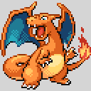 | [`graphics/pokemon/charizard-front-rev0-de.png`](graphics/pokemon/charizard-front-rev0-de.png) | German | 128x128 | `797b28665827c19e...` |
|  | [`graphics/pokemon/charizard-front-rev0-debug-de.png`](graphics/pokemon/charizard-front-rev0-debug-de.png) | German | 128x128 | `797b28665827c19e...` |
|  | [`graphics/pokemon/charizard-front-rev1-de.png`](graphics/pokemon/charizard-front-rev1-de.png) | German | 128x128 | `797b28665827c19e...` |
|  | [`graphics/pokemon/charmander-back-rev0-de.png`](graphics/pokemon/charmander-back-rev0-de.png) | German | 128x128 | `0521ce266d4c527f...` |
|  | [`graphics/pokemon/charmander-back-rev0-debug-de.png`](graphics/pokemon/charmander-back-rev0-debug-de.png) | German | 128x128 | `0521ce266d4c527f...` |
|  | [`graphics/pokemon/charmander-back-rev1-de.png`](graphics/pokemon/charmander-back-rev1-de.png) | German | 128x128 | `0521ce266d4c527f...` |
|  | [`graphics/pokemon/charmander-front-rev0-de.png`](graphics/pokemon/charmander-front-rev0-de.png) | German | 128x128 | `c2521fd7f5d54944...` |
|  | [`graphics/pokemon/charmander-front-rev0-debug-de.png`](graphics/pokemon/charmander-front-rev0-debug-de.png) | German | 128x128 | `c2521fd7f5d54944...` |
|  | [`graphics/pokemon/charmander-front-rev1-de.png`](graphics/pokemon/charmander-front-rev1-de.png) | German | 128x128 | `c2521fd7f5d54944...` |
|  | [`graphics/pokemon/charmeleon-back-rev0-de.png`](graphics/pokemon/charmeleon-back-rev0-de.png) | German | 128x128 | `930bd0b4b2900d41...` |
|  | [`graphics/pokemon/charmeleon-back-rev0-debug-de.png`](graphics/pokemon/charmeleon-back-rev0-debug-de.png) | German | 128x128 | `930bd0b4b2900d41...` |
|  | [`graphics/pokemon/charmeleon-back-rev1-de.png`](graphics/pokemon/charmeleon-back-rev1-de.png) | German | 128x128 | `930bd0b4b2900d41...` |
|  | [`graphics/pokemon/charmeleon-front-rev0-de.png`](graphics/pokemon/charmeleon-front-rev0-de.png) | German | 128x128 | `81a6fbf60b8bfd50...` |
|  | [`graphics/pokemon/charmeleon-front-rev0-debug-de.png`](graphics/pokemon/charmeleon-front-rev0-debug-de.png) | German | 128x128 | `81a6fbf60b8bfd50...` |
|  | [`graphics/pokemon/charmeleon-front-rev1-de.png`](graphics/pokemon/charmeleon-front-rev1-de.png) | German | 128x128 | `81a6fbf60b8bfd50...` |
|  | [`graphics/pokemon/ivysaur-back-rev0-de.png`](graphics/pokemon/ivysaur-back-rev0-de.png) | German | 128x128 | `57f839867dfb4f04...` |
|  | [`graphics/pokemon/ivysaur-back-rev0-debug-de.png`](graphics/pokemon/ivysaur-back-rev0-debug-de.png) | German | 128x128 | `57f839867dfb4f04...` |
|  | [`graphics/pokemon/ivysaur-back-rev1-de.png`](graphics/pokemon/ivysaur-back-rev1-de.png) | German | 128x128 | `57f839867dfb4f04...` |
|  | [`graphics/pokemon/ivysaur-front-rev0-de.png`](graphics/pokemon/ivysaur-front-rev0-de.png) | German | 128x128 | `317ca13389c4a268...` |
|  | [`graphics/pokemon/ivysaur-front-rev0-debug-de.png`](graphics/pokemon/ivysaur-front-rev0-debug-de.png) | German | 128x128 | `317ca13389c4a268...` |
|  | [`graphics/pokemon/ivysaur-front-rev1-de.png`](graphics/pokemon/ivysaur-front-rev1-de.png) | German | 128x128 | `317ca13389c4a268...` |
|  | [`graphics/pokemon/metapod-back-rev0-de.png`](graphics/pokemon/metapod-back-rev0-de.png) | German | 128x128 | `8395dde11cc411d5...` |
|  | [`graphics/pokemon/metapod-back-rev0-debug-de.png`](graphics/pokemon/metapod-back-rev0-debug-de.png) | German | 128x128 | `8395dde11cc411d5...` |
|  | [`graphics/pokemon/metapod-back-rev1-de.png`](graphics/pokemon/metapod-back-rev1-de.png) | German | 128x128 | `8395dde11cc411d5...` |
|  | [`graphics/pokemon/metapod-front-rev0-de.png`](graphics/pokemon/metapod-front-rev0-de.png) | German | 128x128 | `d256a09933b47d5c...` |
|  | [`graphics/pokemon/metapod-front-rev0-debug-de.png`](graphics/pokemon/metapod-front-rev0-debug-de.png) | German | 128x128 | `d256a09933b47d5c...` |
|  | [`graphics/pokemon/metapod-front-rev1-de.png`](graphics/pokemon/metapod-front-rev1-de.png) | German | 128x128 | `d256a09933b47d5c...` |
|  | [`graphics/pokemon/pikachu-back-rev0-de.png`](graphics/pokemon/pikachu-back-rev0-de.png) | German | 128x128 | `d1472dd2f4862fe9...` |
|  | [`graphics/pokemon/pikachu-back-rev0-debug-de.png`](graphics/pokemon/pikachu-back-rev0-debug-de.png) | German | 128x128 | `d1472dd2f4862fe9...` |
|  | [`graphics/pokemon/pikachu-back-rev1-de.png`](graphics/pokemon/pikachu-back-rev1-de.png) | German | 128x128 | `d1472dd2f4862fe9...` |
|  | [`graphics/pokemon/pikachu-front-rev0-de.png`](graphics/pokemon/pikachu-front-rev0-de.png) | German | 128x128 | `0be25ad9c369dfb5...` |
|  | [`graphics/pokemon/pikachu-front-rev0-debug-de.png`](graphics/pokemon/pikachu-front-rev0-debug-de.png) | German | 128x128 | `0be25ad9c369dfb5...` |
|  | [`graphics/pokemon/pikachu-front-rev1-de.png`](graphics/pokemon/pikachu-front-rev1-de.png) | German | 128x128 | `0be25ad9c369dfb5...` |
|  | [`graphics/pokemon/squirtle-back-rev0-de.png`](graphics/pokemon/squirtle-back-rev0-de.png) | German | 128x128 | `c80710c9b72dc8c6...` |
|  | [`graphics/pokemon/squirtle-back-rev0-debug-de.png`](graphics/pokemon/squirtle-back-rev0-debug-de.png) | German | 128x128 | `c80710c9b72dc8c6...` |
|  | [`graphics/pokemon/squirtle-back-rev1-de.png`](graphics/pokemon/squirtle-back-rev1-de.png) | German | 128x128 | `c80710c9b72dc8c6...` |
|  | [`graphics/pokemon/squirtle-front-rev0-de.png`](graphics/pokemon/squirtle-front-rev0-de.png) | German | 128x128 | `867c957520288232...` |
|  | [`graphics/pokemon/squirtle-front-rev0-debug-de.png`](graphics/pokemon/squirtle-front-rev0-debug-de.png) | German | 128x128 | `867c957520288232...` |
|  | [`graphics/pokemon/squirtle-front-rev1-de.png`](graphics/pokemon/squirtle-front-rev1-de.png) | German | 128x128 | `867c957520288232...` |
|  | [`graphics/pokemon/venusaur-back-rev0-de.png`](graphics/pokemon/venusaur-back-rev0-de.png) | German | 128x128 | `8467656ef54308b2...` |
|  | [`graphics/pokemon/venusaur-back-rev0-debug-de.png`](graphics/pokemon/venusaur-back-rev0-debug-de.png) | German | 128x128 | `8467656ef54308b2...` |
|  | [`graphics/pokemon/venusaur-back-rev1-de.png`](graphics/pokemon/venusaur-back-rev1-de.png) | German | 128x128 | `8467656ef54308b2...` |
|  | [`graphics/pokemon/venusaur-front-rev0-de.png`](graphics/pokemon/venusaur-front-rev0-de.png) | German | 128x128 | `9c6f9fdb302031aa...` |
|  | [`graphics/pokemon/venusaur-front-rev0-debug-de.png`](graphics/pokemon/venusaur-front-rev0-debug-de.png) | German | 128x128 | `9c6f9fdb302031aa...` |
|  | [`graphics/pokemon/venusaur-front-rev1-de.png`](graphics/pokemon/venusaur-front-rev1-de.png) | German | 128x128 | `9c6f9fdb302031aa...` |
|  | [`graphics/pokemon/wartortle-back-rev0-de.png`](graphics/pokemon/wartortle-back-rev0-de.png) | German | 128x128 | `8942792e813fb742...` |
|  | [`graphics/pokemon/wartortle-back-rev0-debug-de.png`](graphics/pokemon/wartortle-back-rev0-debug-de.png) | German | 128x128 | `8942792e813fb742...` |
|  | [`graphics/pokemon/wartortle-back-rev1-de.png`](graphics/pokemon/wartortle-back-rev1-de.png) | German | 128x128 | `8942792e813fb742...` |
|  | [`graphics/pokemon/wartortle-front-rev0-de.png`](graphics/pokemon/wartortle-front-rev0-de.png) | German | 128x128 | `b1cfdce661ac366e...` |
|  | [`graphics/pokemon/wartortle-front-rev0-debug-de.png`](graphics/pokemon/wartortle-front-rev0-debug-de.png) | German | 128x128 | `b1cfdce661ac366e...` |
|  | [`graphics/pokemon/wartortle-front-rev1-de.png`](graphics/pokemon/wartortle-front-rev1-de.png) | German | 128x128 | `b1cfdce661ac366e...` |
|  | [`graphics/pokemon/blastoise-back-rev0-fr.png`](graphics/pokemon/blastoise-back-rev0-fr.png) | French | 128x128 | `023258b041aca5b0...` |
|  | [`graphics/pokemon/blastoise-back-rev1-fr.png`](graphics/pokemon/blastoise-back-rev1-fr.png) | French | 128x128 | `023258b041aca5b0...` |
|  | [`graphics/pokemon/blastoise-front-rev0-fr.png`](graphics/pokemon/blastoise-front-rev0-fr.png) | French | 128x128 | `d42812517389bf5d...` |
|  | [`graphics/pokemon/blastoise-front-rev1-fr.png`](graphics/pokemon/blastoise-front-rev1-fr.png) | French | 128x128 | `d42812517389bf5d...` |
|  | [`graphics/pokemon/bulbasaur-back-rev0-fr.png`](graphics/pokemon/bulbasaur-back-rev0-fr.png) | French | 128x128 | `a56ef8e9a9b690fc...` |
|  | [`graphics/pokemon/bulbasaur-back-rev1-fr.png`](graphics/pokemon/bulbasaur-back-rev1-fr.png) | French | 128x128 | `a56ef8e9a9b690fc...` |
|  | [`graphics/pokemon/bulbasaur-front-rev0-fr.png`](graphics/pokemon/bulbasaur-front-rev0-fr.png) | French | 128x128 | `8a325c6541282fa7...` |
|  | [`graphics/pokemon/bulbasaur-front-rev1-fr.png`](graphics/pokemon/bulbasaur-front-rev1-fr.png) | French | 128x128 | `8a325c6541282fa7...` |
|  | [`graphics/pokemon/butterfree-back-rev0-fr.png`](graphics/pokemon/butterfree-back-rev0-fr.png) | French | 128x128 | `1b00ee385be0beef...` |
|  | [`graphics/pokemon/butterfree-back-rev1-fr.png`](graphics/pokemon/butterfree-back-rev1-fr.png) | French | 128x128 | `1b00ee385be0beef...` |
|  | [`graphics/pokemon/butterfree-front-rev0-fr.png`](graphics/pokemon/butterfree-front-rev0-fr.png) | French | 128x128 | `b983f495975ce890...` |
|  | [`graphics/pokemon/butterfree-front-rev1-fr.png`](graphics/pokemon/butterfree-front-rev1-fr.png) | French | 128x128 | `b983f495975ce890...` |
|  | [`graphics/pokemon/caterpie-back-rev0-fr.png`](graphics/pokemon/caterpie-back-rev0-fr.png) | French | 128x128 | `925ae814b8fed35b...` |
|  | [`graphics/pokemon/caterpie-back-rev1-fr.png`](graphics/pokemon/caterpie-back-rev1-fr.png) | French | 128x128 | `925ae814b8fed35b...` |
|  | [`graphics/pokemon/caterpie-front-rev0-fr.png`](graphics/pokemon/caterpie-front-rev0-fr.png) | French | 128x128 | `41316760a707eea2...` |
|  | [`graphics/pokemon/caterpie-front-rev1-fr.png`](graphics/pokemon/caterpie-front-rev1-fr.png) | French | 128x128 | `41316760a707eea2...` |
|  | [`graphics/pokemon/charizard-back-rev0-fr.png`](graphics/pokemon/charizard-back-rev0-fr.png) | French | 128x128 | `3d0a42b79e5f9b53...` |
|  | [`graphics/pokemon/charizard-back-rev1-fr.png`](graphics/pokemon/charizard-back-rev1-fr.png) | French | 128x128 | `3d0a42b79e5f9b53...` |
|  | [`graphics/pokemon/charizard-front-rev0-fr.png`](graphics/pokemon/charizard-front-rev0-fr.png) | French | 128x128 | `797b28665827c19e...` |
|  | [`graphics/pokemon/charizard-front-rev1-fr.png`](graphics/pokemon/charizard-front-rev1-fr.png) | French | 128x128 | `797b28665827c19e...` |
|  | [`graphics/pokemon/charmander-back-rev0-fr.png`](graphics/pokemon/charmander-back-rev0-fr.png) | French | 128x128 | `0521ce266d4c527f...` |
|  | [`graphics/pokemon/charmander-back-rev1-fr.png`](graphics/pokemon/charmander-back-rev1-fr.png) | French | 128x128 | `0521ce266d4c527f...` |
|  | [`graphics/pokemon/charmander-front-rev0-fr.png`](graphics/pokemon/charmander-front-rev0-fr.png) | French | 128x128 | `c2521fd7f5d54944...` |
|  | [`graphics/pokemon/charmander-front-rev1-fr.png`](graphics/pokemon/charmander-front-rev1-fr.png) | French | 128x128 | `c2521fd7f5d54944...` |
|  | [`graphics/pokemon/charmeleon-back-rev0-fr.png`](graphics/pokemon/charmeleon-back-rev0-fr.png) | French | 128x128 | `930bd0b4b2900d41...` |
|  | [`graphics/pokemon/charmeleon-back-rev1-fr.png`](graphics/pokemon/charmeleon-back-rev1-fr.png) | French | 128x128 | `930bd0b4b2900d41...` |
|  | [`graphics/pokemon/charmeleon-front-rev0-fr.png`](graphics/pokemon/charmeleon-front-rev0-fr.png) | French | 128x128 | `81a6fbf60b8bfd50...` |
|  | [`graphics/pokemon/charmeleon-front-rev1-fr.png`](graphics/pokemon/charmeleon-front-rev1-fr.png) | French | 128x128 | `81a6fbf60b8bfd50...` |
|  | [`graphics/pokemon/ivysaur-back-rev0-fr.png`](graphics/pokemon/ivysaur-back-rev0-fr.png) | French | 128x128 | `57f839867dfb4f04...` |
|  | [`graphics/pokemon/ivysaur-back-rev1-fr.png`](graphics/pokemon/ivysaur-back-rev1-fr.png) | French | 128x128 | `57f839867dfb4f04...` |
|  | [`graphics/pokemon/ivysaur-front-rev0-fr.png`](graphics/pokemon/ivysaur-front-rev0-fr.png) | French | 128x128 | `317ca13389c4a268...` |
|  | [`graphics/pokemon/ivysaur-front-rev1-fr.png`](graphics/pokemon/ivysaur-front-rev1-fr.png) | French | 128x128 | `317ca13389c4a268...` |
|  | [`graphics/pokemon/metapod-back-rev0-fr.png`](graphics/pokemon/metapod-back-rev0-fr.png) | French | 128x128 | `8395dde11cc411d5...` |
|  | [`graphics/pokemon/metapod-back-rev1-fr.png`](graphics/pokemon/metapod-back-rev1-fr.png) | French | 128x128 | `8395dde11cc411d5...` |
|  | [`graphics/pokemon/metapod-front-rev0-fr.png`](graphics/pokemon/metapod-front-rev0-fr.png) | French | 128x128 | `d256a09933b47d5c...` |
|  | [`graphics/pokemon/metapod-front-rev1-fr.png`](graphics/pokemon/metapod-front-rev1-fr.png) | French | 128x128 | `d256a09933b47d5c...` |
|  | [`graphics/pokemon/pikachu-back-rev0-fr.png`](graphics/pokemon/pikachu-back-rev0-fr.png) | French | 128x128 | `d1472dd2f4862fe9...` |
|  | [`graphics/pokemon/pikachu-back-rev1-fr.png`](graphics/pokemon/pikachu-back-rev1-fr.png) | French | 128x128 | `d1472dd2f4862fe9...` |
|  | [`graphics/pokemon/pikachu-front-rev0-fr.png`](graphics/pokemon/pikachu-front-rev0-fr.png) | French | 128x128 | `0be25ad9c369dfb5...` |
|  | [`graphics/pokemon/pikachu-front-rev1-fr.png`](graphics/pokemon/pikachu-front-rev1-fr.png) | French | 128x128 | `0be25ad9c369dfb5...` |
|  | [`graphics/pokemon/squirtle-back-rev0-fr.png`](graphics/pokemon/squirtle-back-rev0-fr.png) | French | 128x128 | `c80710c9b72dc8c6...` |
|  | [`graphics/pokemon/squirtle-back-rev1-fr.png`](graphics/pokemon/squirtle-back-rev1-fr.png) | French | 128x128 | `c80710c9b72dc8c6...` |
|  | [`graphics/pokemon/squirtle-front-rev0-fr.png`](graphics/pokemon/squirtle-front-rev0-fr.png) | French | 128x128 | `867c957520288232...` |
|  | [`graphics/pokemon/squirtle-front-rev1-fr.png`](graphics/pokemon/squirtle-front-rev1-fr.png) | French | 128x128 | `867c957520288232...` |
|  | [`graphics/pokemon/venusaur-back-rev0-fr.png`](graphics/pokemon/venusaur-back-rev0-fr.png) | French | 128x128 | `8467656ef54308b2...` |
|  | [`graphics/pokemon/venusaur-back-rev1-fr.png`](graphics/pokemon/venusaur-back-rev1-fr.png) | French | 128x128 | `8467656ef54308b2...` |
|  | [`graphics/pokemon/venusaur-front-rev0-fr.png`](graphics/pokemon/venusaur-front-rev0-fr.png) | French | 128x128 | `9c6f9fdb302031aa...` |
|  | [`graphics/pokemon/venusaur-front-rev1-fr.png`](graphics/pokemon/venusaur-front-rev1-fr.png) | French | 128x128 | `9c6f9fdb302031aa...` |
|  | [`graphics/pokemon/wartortle-back-rev0-fr.png`](graphics/pokemon/wartortle-back-rev0-fr.png) | French | 128x128 | `8942792e813fb742...` |
| 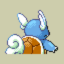 | [`graphics/pokemon/wartortle-back-rev1-fr.png`](graphics/pokemon/wartortle-back-rev1-fr.png) | French | 128x128 | `8942792e813fb742...` |
|  | [`graphics/pokemon/wartortle-front-rev0-fr.png`](graphics/pokemon/wartortle-front-rev0-fr.png) | French | 128x128 | `b1cfdce661ac366e...` |
|  | [`graphics/pokemon/wartortle-front-rev1-fr.png`](graphics/pokemon/wartortle-front-rev1-fr.png) | French | 128x128 | `b1cfdce661ac366e...` |
|  | [`graphics/pokemon/blastoise-back-rev0-it.png`](graphics/pokemon/blastoise-back-rev0-it.png) | Italian | 128x128 | `023258b041aca5b0...` |
|  | [`graphics/pokemon/blastoise-back-rev1-it.png`](graphics/pokemon/blastoise-back-rev1-it.png) | Italian | 128x128 | `023258b041aca5b0...` |
|  | [`graphics/pokemon/blastoise-front-rev0-it.png`](graphics/pokemon/blastoise-front-rev0-it.png) | Italian | 128x128 | `d42812517389bf5d...` |
|  | [`graphics/pokemon/blastoise-front-rev1-it.png`](graphics/pokemon/blastoise-front-rev1-it.png) | Italian | 128x128 | `d42812517389bf5d...` |
|  | [`graphics/pokemon/bulbasaur-back-rev0-it.png`](graphics/pokemon/bulbasaur-back-rev0-it.png) | Italian | 128x128 | `a56ef8e9a9b690fc...` |
|  | [`graphics/pokemon/bulbasaur-back-rev1-it.png`](graphics/pokemon/bulbasaur-back-rev1-it.png) | Italian | 128x128 | `a56ef8e9a9b690fc...` |
|  | [`graphics/pokemon/bulbasaur-front-rev0-it.png`](graphics/pokemon/bulbasaur-front-rev0-it.png) | Italian | 128x128 | `8a325c6541282fa7...` |
|  | [`graphics/pokemon/bulbasaur-front-rev1-it.png`](graphics/pokemon/bulbasaur-front-rev1-it.png) | Italian | 128x128 | `8a325c6541282fa7...` |
|  | [`graphics/pokemon/butterfree-back-rev0-it.png`](graphics/pokemon/butterfree-back-rev0-it.png) | Italian | 128x128 | `1b00ee385be0beef...` |
|  | [`graphics/pokemon/butterfree-back-rev1-it.png`](graphics/pokemon/butterfree-back-rev1-it.png) | Italian | 128x128 | `1b00ee385be0beef...` |
| 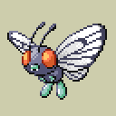 | [`graphics/pokemon/butterfree-front-rev0-it.png`](graphics/pokemon/butterfree-front-rev0-it.png) | Italian | 128x128 | `b983f495975ce890...` |
|  | [`graphics/pokemon/butterfree-front-rev1-it.png`](graphics/pokemon/butterfree-front-rev1-it.png) | Italian | 128x128 | `b983f495975ce890...` |
|  | [`graphics/pokemon/caterpie-back-rev0-it.png`](graphics/pokemon/caterpie-back-rev0-it.png) | Italian | 128x128 | `925ae814b8fed35b...` |
| 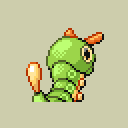 | [`graphics/pokemon/caterpie-back-rev1-it.png`](graphics/pokemon/caterpie-back-rev1-it.png) | Italian | 128x128 | `925ae814b8fed35b...` |
|  | [`graphics/pokemon/caterpie-front-rev0-it.png`](graphics/pokemon/caterpie-front-rev0-it.png) | Italian | 128x128 | `41316760a707eea2...` |
|  | [`graphics/pokemon/caterpie-front-rev1-it.png`](graphics/pokemon/caterpie-front-rev1-it.png) | Italian | 128x128 | `41316760a707eea2...` |
|  | [`graphics/pokemon/charizard-back-rev0-it.png`](graphics/pokemon/charizard-back-rev0-it.png) | Italian | 128x128 | `3d0a42b79e5f9b53...` |
|  | [`graphics/pokemon/charizard-back-rev1-it.png`](graphics/pokemon/charizard-back-rev1-it.png) | Italian | 128x128 | `3d0a42b79e5f9b53...` |
|  | [`graphics/pokemon/charizard-front-rev0-it.png`](graphics/pokemon/charizard-front-rev0-it.png) | Italian | 128x128 | `797b28665827c19e...` |
|  | [`graphics/pokemon/charizard-front-rev1-it.png`](graphics/pokemon/charizard-front-rev1-it.png) | Italian | 128x128 | `797b28665827c19e...` |
|  | [`graphics/pokemon/charmander-back-rev0-it.png`](graphics/pokemon/charmander-back-rev0-it.png) | Italian | 128x128 | `0521ce266d4c527f...` |
|  | [`graphics/pokemon/charmander-back-rev1-it.png`](graphics/pokemon/charmander-back-rev1-it.png) | Italian | 128x128 | `0521ce266d4c527f...` |
|  | [`graphics/pokemon/charmander-front-rev0-it.png`](graphics/pokemon/charmander-front-rev0-it.png) | Italian | 128x128 | `c2521fd7f5d54944...` |
|  | [`graphics/pokemon/charmander-front-rev1-it.png`](graphics/pokemon/charmander-front-rev1-it.png) | Italian | 128x128 | `c2521fd7f5d54944...` |
|  | [`graphics/pokemon/charmeleon-back-rev0-it.png`](graphics/pokemon/charmeleon-back-rev0-it.png) | Italian | 128x128 | `930bd0b4b2900d41...` |
| 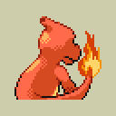 | [`graphics/pokemon/charmeleon-back-rev1-it.png`](graphics/pokemon/charmeleon-back-rev1-it.png) | Italian | 128x128 | `930bd0b4b2900d41...` |
|  | [`graphics/pokemon/charmeleon-front-rev0-it.png`](graphics/pokemon/charmeleon-front-rev0-it.png) | Italian | 128x128 | `81a6fbf60b8bfd50...` |
|  | [`graphics/pokemon/charmeleon-front-rev1-it.png`](graphics/pokemon/charmeleon-front-rev1-it.png) | Italian | 128x128 | `81a6fbf60b8bfd50...` |
|  | [`graphics/pokemon/ivysaur-back-rev0-it.png`](graphics/pokemon/ivysaur-back-rev0-it.png) | Italian | 128x128 | `57f839867dfb4f04...` |
|  | [`graphics/pokemon/ivysaur-back-rev1-it.png`](graphics/pokemon/ivysaur-back-rev1-it.png) | Italian | 128x128 | `57f839867dfb4f04...` |
|  | [`graphics/pokemon/ivysaur-front-rev0-it.png`](graphics/pokemon/ivysaur-front-rev0-it.png) | Italian | 128x128 | `317ca13389c4a268...` |
|  | [`graphics/pokemon/ivysaur-front-rev1-it.png`](graphics/pokemon/ivysaur-front-rev1-it.png) | Italian | 128x128 | `317ca13389c4a268...` |
|  | [`graphics/pokemon/metapod-back-rev0-it.png`](graphics/pokemon/metapod-back-rev0-it.png) | Italian | 128x128 | `8395dde11cc411d5...` |
|  | [`graphics/pokemon/metapod-back-rev1-it.png`](graphics/pokemon/metapod-back-rev1-it.png) | Italian | 128x128 | `8395dde11cc411d5...` |
|  | [`graphics/pokemon/metapod-front-rev0-it.png`](graphics/pokemon/metapod-front-rev0-it.png) | Italian | 128x128 | `d256a09933b47d5c...` |
|  | [`graphics/pokemon/metapod-front-rev1-it.png`](graphics/pokemon/metapod-front-rev1-it.png) | Italian | 128x128 | `d256a09933b47d5c...` |
|  | [`graphics/pokemon/pikachu-back-rev0-it.png`](graphics/pokemon/pikachu-back-rev0-it.png) | Italian | 128x128 | `d1472dd2f4862fe9...` |
|  | [`graphics/pokemon/pikachu-back-rev1-it.png`](graphics/pokemon/pikachu-back-rev1-it.png) | Italian | 128x128 | `d1472dd2f4862fe9...` |
|  | [`graphics/pokemon/pikachu-front-rev0-it.png`](graphics/pokemon/pikachu-front-rev0-it.png) | Italian | 128x128 | `0be25ad9c369dfb5...` |
|  | [`graphics/pokemon/pikachu-front-rev1-it.png`](graphics/pokemon/pikachu-front-rev1-it.png) | Italian | 128x128 | `0be25ad9c369dfb5...` |
|  | [`graphics/pokemon/squirtle-back-rev0-it.png`](graphics/pokemon/squirtle-back-rev0-it.png) | Italian | 128x128 | `c80710c9b72dc8c6...` |
|  | [`graphics/pokemon/squirtle-back-rev1-it.png`](graphics/pokemon/squirtle-back-rev1-it.png) | Italian | 128x128 | `c80710c9b72dc8c6...` |
|  | [`graphics/pokemon/squirtle-front-rev0-it.png`](graphics/pokemon/squirtle-front-rev0-it.png) | Italian | 128x128 | `867c957520288232...` |
|  | [`graphics/pokemon/squirtle-front-rev1-it.png`](graphics/pokemon/squirtle-front-rev1-it.png) | Italian | 128x128 | `867c957520288232...` |
|  | [`graphics/pokemon/venusaur-back-rev0-it.png`](graphics/pokemon/venusaur-back-rev0-it.png) | Italian | 128x128 | `8467656ef54308b2...` |
|  | [`graphics/pokemon/venusaur-back-rev1-it.png`](graphics/pokemon/venusaur-back-rev1-it.png) | Italian | 128x128 | `8467656ef54308b2...` |
|  | [`graphics/pokemon/venusaur-front-rev0-it.png`](graphics/pokemon/venusaur-front-rev0-it.png) | Italian | 128x128 | `9c6f9fdb302031aa...` |
|  | [`graphics/pokemon/venusaur-front-rev1-it.png`](graphics/pokemon/venusaur-front-rev1-it.png) | Italian | 128x128 | `9c6f9fdb302031aa...` |
|  | [`graphics/pokemon/wartortle-back-rev0-it.png`](graphics/pokemon/wartortle-back-rev0-it.png) | Italian | 128x128 | `8942792e813fb742...` |
|  | [`graphics/pokemon/wartortle-back-rev1-it.png`](graphics/pokemon/wartortle-back-rev1-it.png) | Italian | 128x128 | `8942792e813fb742...` |
|  | [`graphics/pokemon/wartortle-front-rev0-it.png`](graphics/pokemon/wartortle-front-rev0-it.png) | Italian | 128x128 | `b1cfdce661ac366e...` |
|  | [`graphics/pokemon/wartortle-front-rev1-it.png`](graphics/pokemon/wartortle-front-rev1-it.png) | Italian | 128x128 | `b1cfdce661ac366e...` |
|  | [`graphics/pokemon/blastoise-back-rev0-es.png`](graphics/pokemon/blastoise-back-rev0-es.png) | Spanish | 128x128 | `023258b041aca5b0...` |
| 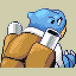 | [`graphics/pokemon/blastoise-back-rev1-es.png`](graphics/pokemon/blastoise-back-rev1-es.png) | Spanish | 128x128 | `023258b041aca5b0...` |
|  | [`graphics/pokemon/blastoise-front-rev0-es.png`](graphics/pokemon/blastoise-front-rev0-es.png) | Spanish | 128x128 | `d42812517389bf5d...` |
|  | [`graphics/pokemon/blastoise-front-rev1-es.png`](graphics/pokemon/blastoise-front-rev1-es.png) | Spanish | 128x128 | `d42812517389bf5d...` |
|  | [`graphics/pokemon/bulbasaur-back-rev0-es.png`](graphics/pokemon/bulbasaur-back-rev0-es.png) | Spanish | 128x128 | `a56ef8e9a9b690fc...` |
|  | [`graphics/pokemon/bulbasaur-back-rev1-es.png`](graphics/pokemon/bulbasaur-back-rev1-es.png) | Spanish | 128x128 | `a56ef8e9a9b690fc...` |
|  | [`graphics/pokemon/bulbasaur-front-rev0-es.png`](graphics/pokemon/bulbasaur-front-rev0-es.png) | Spanish | 128x128 | `8a325c6541282fa7...` |
|  | [`graphics/pokemon/bulbasaur-front-rev1-es.png`](graphics/pokemon/bulbasaur-front-rev1-es.png) | Spanish | 128x128 | `8a325c6541282fa7...` |
|  | [`graphics/pokemon/butterfree-back-rev0-es.png`](graphics/pokemon/butterfree-back-rev0-es.png) | Spanish | 128x128 | `1b00ee385be0beef...` |
| 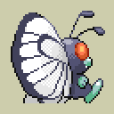 | [`graphics/pokemon/butterfree-back-rev1-es.png`](graphics/pokemon/butterfree-back-rev1-es.png) | Spanish | 128x128 | `1b00ee385be0beef...` |
|  | [`graphics/pokemon/butterfree-front-rev0-es.png`](graphics/pokemon/butterfree-front-rev0-es.png) | Spanish | 128x128 | `b983f495975ce890...` |
|  | [`graphics/pokemon/butterfree-front-rev1-es.png`](graphics/pokemon/butterfree-front-rev1-es.png) | Spanish | 128x128 | `b983f495975ce890...` |
|  | [`graphics/pokemon/caterpie-back-rev0-es.png`](graphics/pokemon/caterpie-back-rev0-es.png) | Spanish | 128x128 | `925ae814b8fed35b...` |
|  | [`graphics/pokemon/caterpie-back-rev1-es.png`](graphics/pokemon/caterpie-back-rev1-es.png) | Spanish | 128x128 | `925ae814b8fed35b...` |
| 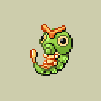 | [`graphics/pokemon/caterpie-front-rev0-es.png`](graphics/pokemon/caterpie-front-rev0-es.png) | Spanish | 128x128 | `41316760a707eea2...` |
|  | [`graphics/pokemon/caterpie-front-rev1-es.png`](graphics/pokemon/caterpie-front-rev1-es.png) | Spanish | 128x128 | `41316760a707eea2...` |
|  | [`graphics/pokemon/charizard-back-rev0-es.png`](graphics/pokemon/charizard-back-rev0-es.png) | Spanish | 128x128 | `3d0a42b79e5f9b53...` |
|  | [`graphics/pokemon/charizard-back-rev1-es.png`](graphics/pokemon/charizard-back-rev1-es.png) | Spanish | 128x128 | `3d0a42b79e5f9b53...` |
|  | [`graphics/pokemon/charizard-front-rev0-es.png`](graphics/pokemon/charizard-front-rev0-es.png) | Spanish | 128x128 | `797b28665827c19e...` |
|  | [`graphics/pokemon/charizard-front-rev1-es.png`](graphics/pokemon/charizard-front-rev1-es.png) | Spanish | 128x128 | `797b28665827c19e...` |
|  | [`graphics/pokemon/charmander-back-rev0-es.png`](graphics/pokemon/charmander-back-rev0-es.png) | Spanish | 128x128 | `0521ce266d4c527f...` |
|  | [`graphics/pokemon/charmander-back-rev1-es.png`](graphics/pokemon/charmander-back-rev1-es.png) | Spanish | 128x128 | `0521ce266d4c527f...` |
|  | [`graphics/pokemon/charmander-front-rev0-es.png`](graphics/pokemon/charmander-front-rev0-es.png) | Spanish | 128x128 | `c2521fd7f5d54944...` |
|  | [`graphics/pokemon/charmander-front-rev1-es.png`](graphics/pokemon/charmander-front-rev1-es.png) | Spanish | 128x128 | `c2521fd7f5d54944...` |
|  | [`graphics/pokemon/charmeleon-back-rev0-es.png`](graphics/pokemon/charmeleon-back-rev0-es.png) | Spanish | 128x128 | `930bd0b4b2900d41...` |
|  | [`graphics/pokemon/charmeleon-back-rev1-es.png`](graphics/pokemon/charmeleon-back-rev1-es.png) | Spanish | 128x128 | `930bd0b4b2900d41...` |
|  | [`graphics/pokemon/charmeleon-front-rev0-es.png`](graphics/pokemon/charmeleon-front-rev0-es.png) | Spanish | 128x128 | `81a6fbf60b8bfd50...` |
|  | [`graphics/pokemon/charmeleon-front-rev1-es.png`](graphics/pokemon/charmeleon-front-rev1-es.png) | Spanish | 128x128 | `81a6fbf60b8bfd50...` |
|  | [`graphics/pokemon/ivysaur-back-rev0-es.png`](graphics/pokemon/ivysaur-back-rev0-es.png) | Spanish | 128x128 | `57f839867dfb4f04...` |
|  | [`graphics/pokemon/ivysaur-back-rev1-es.png`](graphics/pokemon/ivysaur-back-rev1-es.png) | Spanish | 128x128 | `57f839867dfb4f04...` |
|  | [`graphics/pokemon/ivysaur-front-rev0-es.png`](graphics/pokemon/ivysaur-front-rev0-es.png) | Spanish | 128x128 | `317ca13389c4a268...` |
|  | [`graphics/pokemon/ivysaur-front-rev1-es.png`](graphics/pokemon/ivysaur-front-rev1-es.png) | Spanish | 128x128 | `317ca13389c4a268...` |
|  | [`graphics/pokemon/metapod-back-rev0-es.png`](graphics/pokemon/metapod-back-rev0-es.png) | Spanish | 128x128 | `8395dde11cc411d5...` |
|  | [`graphics/pokemon/metapod-back-rev1-es.png`](graphics/pokemon/metapod-back-rev1-es.png) | Spanish | 128x128 | `8395dde11cc411d5...` |
|  | [`graphics/pokemon/metapod-front-rev0-es.png`](graphics/pokemon/metapod-front-rev0-es.png) | Spanish | 128x128 | `d256a09933b47d5c...` |
|  | [`graphics/pokemon/metapod-front-rev1-es.png`](graphics/pokemon/metapod-front-rev1-es.png) | Spanish | 128x128 | `d256a09933b47d5c...` |
|  | [`graphics/pokemon/pikachu-back-rev0-es.png`](graphics/pokemon/pikachu-back-rev0-es.png) | Spanish | 128x128 | `d1472dd2f4862fe9...` |
|  | [`graphics/pokemon/pikachu-back-rev1-es.png`](graphics/pokemon/pikachu-back-rev1-es.png) | Spanish | 128x128 | `d1472dd2f4862fe9...` |
|  | [`graphics/pokemon/pikachu-front-rev0-es.png`](graphics/pokemon/pikachu-front-rev0-es.png) | Spanish | 128x128 | `0be25ad9c369dfb5...` |
|  | [`graphics/pokemon/pikachu-front-rev1-es.png`](graphics/pokemon/pikachu-front-rev1-es.png) | Spanish | 128x128 | `0be25ad9c369dfb5...` |
|  | [`graphics/pokemon/squirtle-back-rev0-es.png`](graphics/pokemon/squirtle-back-rev0-es.png) | Spanish | 128x128 | `c80710c9b72dc8c6...` |
|  | [`graphics/pokemon/squirtle-back-rev1-es.png`](graphics/pokemon/squirtle-back-rev1-es.png) | Spanish | 128x128 | `c80710c9b72dc8c6...` |
|  | [`graphics/pokemon/squirtle-front-rev0-es.png`](graphics/pokemon/squirtle-front-rev0-es.png) | Spanish | 128x128 | `867c957520288232...` |
|  | [`graphics/pokemon/squirtle-front-rev1-es.png`](graphics/pokemon/squirtle-front-rev1-es.png) | Spanish | 128x128 | `867c957520288232...` |
|  | [`graphics/pokemon/venusaur-back-rev0-es.png`](graphics/pokemon/venusaur-back-rev0-es.png) | Spanish | 128x128 | `8467656ef54308b2...` |
|  | [`graphics/pokemon/venusaur-back-rev1-es.png`](graphics/pokemon/venusaur-back-rev1-es.png) | Spanish | 128x128 | `8467656ef54308b2...` |
|  | [`graphics/pokemon/venusaur-front-rev0-es.png`](graphics/pokemon/venusaur-front-rev0-es.png) | Spanish | 128x128 | `9c6f9fdb302031aa...` |
|  | [`graphics/pokemon/venusaur-front-rev1-es.png`](graphics/pokemon/venusaur-front-rev1-es.png) | Spanish | 128x128 | `9c6f9fdb302031aa...` |
|  | [`graphics/pokemon/wartortle-back-rev0-es.png`](graphics/pokemon/wartortle-back-rev0-es.png) | Spanish | 128x128 | `8942792e813fb742...` |
|  | [`graphics/pokemon/wartortle-back-rev1-es.png`](graphics/pokemon/wartortle-back-rev1-es.png) | Spanish | 128x128 | `8942792e813fb742...` |
|  | [`graphics/pokemon/wartortle-front-rev0-es.png`](graphics/pokemon/wartortle-front-rev0-es.png) | Spanish | 128x128 | `b1cfdce661ac366e...` |
|  | [`graphics/pokemon/wartortle-front-rev1-es.png`](graphics/pokemon/wartortle-front-rev1-es.png) | Spanish | 128x128 | `b1cfdce661ac366e...` |

| Palette | Language | Colors | SHA-256 |
| --- | --- | --- | --- |
| [`graphics/pokemon/blastoise-rev0-jp.pal`](graphics/pokemon/blastoise-rev0-jp.pal) | Japanese | 16 | `82620e8a8070e819...` |
| [`graphics/pokemon/bulbasaur-rev0-jp.pal`](graphics/pokemon/bulbasaur-rev0-jp.pal) | Japanese | 16 | `bb3a45b87ac47a26...` |
| [`graphics/pokemon/butterfree-rev0-jp.pal`](graphics/pokemon/butterfree-rev0-jp.pal) | Japanese | 16 | `025d4f19380be8c0...` |
| [`graphics/pokemon/caterpie-rev0-jp.pal`](graphics/pokemon/caterpie-rev0-jp.pal) | Japanese | 16 | `57bd01be978ab560...` |
| [`graphics/pokemon/charizard-rev0-jp.pal`](graphics/pokemon/charizard-rev0-jp.pal) | Japanese | 16 | `7be8d061c501217a...` |
| [`graphics/pokemon/charmander-rev0-jp.pal`](graphics/pokemon/charmander-rev0-jp.pal) | Japanese | 16 | `8e0275de21f38209...` |
| [`graphics/pokemon/charmeleon-rev0-jp.pal`](graphics/pokemon/charmeleon-rev0-jp.pal) | Japanese | 16 | `fda56b497c54ea3e...` |
| [`graphics/pokemon/ivysaur-rev0-jp.pal`](graphics/pokemon/ivysaur-rev0-jp.pal) | Japanese | 16 | `b33f61ed2e335591...` |
| [`graphics/pokemon/metapod-rev0-jp.pal`](graphics/pokemon/metapod-rev0-jp.pal) | Japanese | 16 | `18f425e54bdf6a0b...` |
| [`graphics/pokemon/pikachu-rev0-jp.pal`](graphics/pokemon/pikachu-rev0-jp.pal) | Japanese | 16 | `066a8707fdfbf027...` |
| [`graphics/pokemon/squirtle-rev0-jp.pal`](graphics/pokemon/squirtle-rev0-jp.pal) | Japanese | 16 | `90702f2e5e66ce90...` |
| [`graphics/pokemon/venusaur-rev0-jp.pal`](graphics/pokemon/venusaur-rev0-jp.pal) | Japanese | 16 | `11606f5afc78f891...` |
| [`graphics/pokemon/wartortle-rev0-jp.pal`](graphics/pokemon/wartortle-rev0-jp.pal) | Japanese | 16 | `935efea83d01ca5c...` |
| [`graphics/pokemon/blastoise-rev0-en.pal`](graphics/pokemon/blastoise-rev0-en.pal) | English | 16 | `82620e8a8070e819...` |
| [`graphics/pokemon/blastoise-rev1-en.pal`](graphics/pokemon/blastoise-rev1-en.pal) | English | 16 | `82620e8a8070e819...` |
| [`graphics/pokemon/blastoise-rev2-en.pal`](graphics/pokemon/blastoise-rev2-en.pal) | English | 16 | `82620e8a8070e819...` |
| [`graphics/pokemon/bulbasaur-rev0-en.pal`](graphics/pokemon/bulbasaur-rev0-en.pal) | English | 16 | `bb3a45b87ac47a26...` |
| [`graphics/pokemon/bulbasaur-rev1-en.pal`](graphics/pokemon/bulbasaur-rev1-en.pal) | English | 16 | `bb3a45b87ac47a26...` |
| [`graphics/pokemon/bulbasaur-rev2-en.pal`](graphics/pokemon/bulbasaur-rev2-en.pal) | English | 16 | `bb3a45b87ac47a26...` |
| [`graphics/pokemon/butterfree-rev0-en.pal`](graphics/pokemon/butterfree-rev0-en.pal) | English | 16 | `025d4f19380be8c0...` |
| [`graphics/pokemon/butterfree-rev1-en.pal`](graphics/pokemon/butterfree-rev1-en.pal) | English | 16 | `025d4f19380be8c0...` |
| [`graphics/pokemon/butterfree-rev2-en.pal`](graphics/pokemon/butterfree-rev2-en.pal) | English | 16 | `025d4f19380be8c0...` |
| [`graphics/pokemon/caterpie-rev0-en.pal`](graphics/pokemon/caterpie-rev0-en.pal) | English | 16 | `57bd01be978ab560...` |
| [`graphics/pokemon/caterpie-rev1-en.pal`](graphics/pokemon/caterpie-rev1-en.pal) | English | 16 | `57bd01be978ab560...` |
| [`graphics/pokemon/caterpie-rev2-en.pal`](graphics/pokemon/caterpie-rev2-en.pal) | English | 16 | `57bd01be978ab560...` |
| [`graphics/pokemon/charizard-rev0-en.pal`](graphics/pokemon/charizard-rev0-en.pal) | English | 16 | `7be8d061c501217a...` |
| [`graphics/pokemon/charizard-rev1-en.pal`](graphics/pokemon/charizard-rev1-en.pal) | English | 16 | `7be8d061c501217a...` |
| [`graphics/pokemon/charizard-rev2-en.pal`](graphics/pokemon/charizard-rev2-en.pal) | English | 16 | `7be8d061c501217a...` |
| [`graphics/pokemon/charmander-rev0-en.pal`](graphics/pokemon/charmander-rev0-en.pal) | English | 16 | `8e0275de21f38209...` |
| [`graphics/pokemon/charmander-rev1-en.pal`](graphics/pokemon/charmander-rev1-en.pal) | English | 16 | `8e0275de21f38209...` |
| [`graphics/pokemon/charmander-rev2-en.pal`](graphics/pokemon/charmander-rev2-en.pal) | English | 16 | `8e0275de21f38209...` |
| [`graphics/pokemon/charmeleon-rev0-en.pal`](graphics/pokemon/charmeleon-rev0-en.pal) | English | 16 | `fda56b497c54ea3e...` |
| [`graphics/pokemon/charmeleon-rev1-en.pal`](graphics/pokemon/charmeleon-rev1-en.pal) | English | 16 | `fda56b497c54ea3e...` |
| [`graphics/pokemon/charmeleon-rev2-en.pal`](graphics/pokemon/charmeleon-rev2-en.pal) | English | 16 | `fda56b497c54ea3e...` |
| [`graphics/pokemon/ivysaur-rev0-en.pal`](graphics/pokemon/ivysaur-rev0-en.pal) | English | 16 | `b33f61ed2e335591...` |
| [`graphics/pokemon/ivysaur-rev1-en.pal`](graphics/pokemon/ivysaur-rev1-en.pal) | English | 16 | `b33f61ed2e335591...` |
| [`graphics/pokemon/ivysaur-rev2-en.pal`](graphics/pokemon/ivysaur-rev2-en.pal) | English | 16 | `b33f61ed2e335591...` |
| [`graphics/pokemon/metapod-rev0-en.pal`](graphics/pokemon/metapod-rev0-en.pal) | English | 16 | `18f425e54bdf6a0b...` |
| [`graphics/pokemon/metapod-rev1-en.pal`](graphics/pokemon/metapod-rev1-en.pal) | English | 16 | `18f425e54bdf6a0b...` |
| [`graphics/pokemon/metapod-rev2-en.pal`](graphics/pokemon/metapod-rev2-en.pal) | English | 16 | `18f425e54bdf6a0b...` |
| [`graphics/pokemon/pikachu-rev0-en.pal`](graphics/pokemon/pikachu-rev0-en.pal) | English | 16 | `066a8707fdfbf027...` |
| [`graphics/pokemon/pikachu-rev1-en.pal`](graphics/pokemon/pikachu-rev1-en.pal) | English | 16 | `066a8707fdfbf027...` |
| [`graphics/pokemon/pikachu-rev2-en.pal`](graphics/pokemon/pikachu-rev2-en.pal) | English | 16 | `066a8707fdfbf027...` |
| [`graphics/pokemon/squirtle-rev0-en.pal`](graphics/pokemon/squirtle-rev0-en.pal) | English | 16 | `90702f2e5e66ce90...` |
| [`graphics/pokemon/squirtle-rev1-en.pal`](graphics/pokemon/squirtle-rev1-en.pal) | English | 16 | `90702f2e5e66ce90...` |
| [`graphics/pokemon/squirtle-rev2-en.pal`](graphics/pokemon/squirtle-rev2-en.pal) | English | 16 | `90702f2e5e66ce90...` |
| [`graphics/pokemon/venusaur-rev0-en.pal`](graphics/pokemon/venusaur-rev0-en.pal) | English | 16 | `11606f5afc78f891...` |
| [`graphics/pokemon/venusaur-rev1-en.pal`](graphics/pokemon/venusaur-rev1-en.pal) | English | 16 | `11606f5afc78f891...` |
| [`graphics/pokemon/venusaur-rev2-en.pal`](graphics/pokemon/venusaur-rev2-en.pal) | English | 16 | `11606f5afc78f891...` |
| [`graphics/pokemon/wartortle-rev0-en.pal`](graphics/pokemon/wartortle-rev0-en.pal) | English | 16 | `935efea83d01ca5c...` |
| [`graphics/pokemon/wartortle-rev1-en.pal`](graphics/pokemon/wartortle-rev1-en.pal) | English | 16 | `935efea83d01ca5c...` |
| [`graphics/pokemon/wartortle-rev2-en.pal`](graphics/pokemon/wartortle-rev2-en.pal) | English | 16 | `935efea83d01ca5c...` |
| [`graphics/pokemon/blastoise-rev0-de.pal`](graphics/pokemon/blastoise-rev0-de.pal) | German | 16 | `82620e8a8070e819...` |
| [`graphics/pokemon/blastoise-rev0-debug-de.pal`](graphics/pokemon/blastoise-rev0-debug-de.pal) | German | 16 | `82620e8a8070e819...` |
| [`graphics/pokemon/blastoise-rev1-de.pal`](graphics/pokemon/blastoise-rev1-de.pal) | German | 16 | `82620e8a8070e819...` |
| [`graphics/pokemon/bulbasaur-rev0-de.pal`](graphics/pokemon/bulbasaur-rev0-de.pal) | German | 16 | `bb3a45b87ac47a26...` |
| [`graphics/pokemon/bulbasaur-rev0-debug-de.pal`](graphics/pokemon/bulbasaur-rev0-debug-de.pal) | German | 16 | `bb3a45b87ac47a26...` |
| [`graphics/pokemon/bulbasaur-rev1-de.pal`](graphics/pokemon/bulbasaur-rev1-de.pal) | German | 16 | `bb3a45b87ac47a26...` |
| [`graphics/pokemon/butterfree-rev0-de.pal`](graphics/pokemon/butterfree-rev0-de.pal) | German | 16 | `025d4f19380be8c0...` |
| [`graphics/pokemon/butterfree-rev0-debug-de.pal`](graphics/pokemon/butterfree-rev0-debug-de.pal) | German | 16 | `025d4f19380be8c0...` |
| [`graphics/pokemon/butterfree-rev1-de.pal`](graphics/pokemon/butterfree-rev1-de.pal) | German | 16 | `025d4f19380be8c0...` |
| [`graphics/pokemon/caterpie-rev0-de.pal`](graphics/pokemon/caterpie-rev0-de.pal) | German | 16 | `57bd01be978ab560...` |
| [`graphics/pokemon/caterpie-rev0-debug-de.pal`](graphics/pokemon/caterpie-rev0-debug-de.pal) | German | 16 | `57bd01be978ab560...` |
| [`graphics/pokemon/caterpie-rev1-de.pal`](graphics/pokemon/caterpie-rev1-de.pal) | German | 16 | `57bd01be978ab560...` |
| [`graphics/pokemon/charizard-rev0-de.pal`](graphics/pokemon/charizard-rev0-de.pal) | German | 16 | `7be8d061c501217a...` |
| [`graphics/pokemon/charizard-rev0-debug-de.pal`](graphics/pokemon/charizard-rev0-debug-de.pal) | German | 16 | `7be8d061c501217a...` |
| [`graphics/pokemon/charizard-rev1-de.pal`](graphics/pokemon/charizard-rev1-de.pal) | German | 16 | `7be8d061c501217a...` |
| [`graphics/pokemon/charmander-rev0-de.pal`](graphics/pokemon/charmander-rev0-de.pal) | German | 16 | `8e0275de21f38209...` |
| [`graphics/pokemon/charmander-rev0-debug-de.pal`](graphics/pokemon/charmander-rev0-debug-de.pal) | German | 16 | `8e0275de21f38209...` |
| [`graphics/pokemon/charmander-rev1-de.pal`](graphics/pokemon/charmander-rev1-de.pal) | German | 16 | `8e0275de21f38209...` |
| [`graphics/pokemon/charmeleon-rev0-de.pal`](graphics/pokemon/charmeleon-rev0-de.pal) | German | 16 | `fda56b497c54ea3e...` |
| [`graphics/pokemon/charmeleon-rev0-debug-de.pal`](graphics/pokemon/charmeleon-rev0-debug-de.pal) | German | 16 | `fda56b497c54ea3e...` |
| [`graphics/pokemon/charmeleon-rev1-de.pal`](graphics/pokemon/charmeleon-rev1-de.pal) | German | 16 | `fda56b497c54ea3e...` |
| [`graphics/pokemon/ivysaur-rev0-de.pal`](graphics/pokemon/ivysaur-rev0-de.pal) | German | 16 | `b33f61ed2e335591...` |
| [`graphics/pokemon/ivysaur-rev0-debug-de.pal`](graphics/pokemon/ivysaur-rev0-debug-de.pal) | German | 16 | `b33f61ed2e335591...` |
| [`graphics/pokemon/ivysaur-rev1-de.pal`](graphics/pokemon/ivysaur-rev1-de.pal) | German | 16 | `b33f61ed2e335591...` |
| [`graphics/pokemon/metapod-rev0-de.pal`](graphics/pokemon/metapod-rev0-de.pal) | German | 16 | `18f425e54bdf6a0b...` |
| [`graphics/pokemon/metapod-rev0-debug-de.pal`](graphics/pokemon/metapod-rev0-debug-de.pal) | German | 16 | `18f425e54bdf6a0b...` |
| [`graphics/pokemon/metapod-rev1-de.pal`](graphics/pokemon/metapod-rev1-de.pal) | German | 16 | `18f425e54bdf6a0b...` |
| [`graphics/pokemon/pikachu-rev0-de.pal`](graphics/pokemon/pikachu-rev0-de.pal) | German | 16 | `066a8707fdfbf027...` |
| [`graphics/pokemon/pikachu-rev0-debug-de.pal`](graphics/pokemon/pikachu-rev0-debug-de.pal) | German | 16 | `066a8707fdfbf027...` |
| [`graphics/pokemon/pikachu-rev1-de.pal`](graphics/pokemon/pikachu-rev1-de.pal) | German | 16 | `066a8707fdfbf027...` |
| [`graphics/pokemon/squirtle-rev0-de.pal`](graphics/pokemon/squirtle-rev0-de.pal) | German | 16 | `90702f2e5e66ce90...` |
| [`graphics/pokemon/squirtle-rev0-debug-de.pal`](graphics/pokemon/squirtle-rev0-debug-de.pal) | German | 16 | `90702f2e5e66ce90...` |
| [`graphics/pokemon/squirtle-rev1-de.pal`](graphics/pokemon/squirtle-rev1-de.pal) | German | 16 | `90702f2e5e66ce90...` |
| [`graphics/pokemon/venusaur-rev0-de.pal`](graphics/pokemon/venusaur-rev0-de.pal) | German | 16 | `11606f5afc78f891...` |
| [`graphics/pokemon/venusaur-rev0-debug-de.pal`](graphics/pokemon/venusaur-rev0-debug-de.pal) | German | 16 | `11606f5afc78f891...` |
| [`graphics/pokemon/venusaur-rev1-de.pal`](graphics/pokemon/venusaur-rev1-de.pal) | German | 16 | `11606f5afc78f891...` |
| [`graphics/pokemon/wartortle-rev0-de.pal`](graphics/pokemon/wartortle-rev0-de.pal) | German | 16 | `935efea83d01ca5c...` |
| [`graphics/pokemon/wartortle-rev0-debug-de.pal`](graphics/pokemon/wartortle-rev0-debug-de.pal) | German | 16 | `935efea83d01ca5c...` |
| [`graphics/pokemon/wartortle-rev1-de.pal`](graphics/pokemon/wartortle-rev1-de.pal) | German | 16 | `935efea83d01ca5c...` |
| [`graphics/pokemon/blastoise-rev0-fr.pal`](graphics/pokemon/blastoise-rev0-fr.pal) | French | 16 | `82620e8a8070e819...` |
| [`graphics/pokemon/blastoise-rev1-fr.pal`](graphics/pokemon/blastoise-rev1-fr.pal) | French | 16 | `82620e8a8070e819...` |
| [`graphics/pokemon/bulbasaur-rev0-fr.pal`](graphics/pokemon/bulbasaur-rev0-fr.pal) | French | 16 | `bb3a45b87ac47a26...` |
| [`graphics/pokemon/bulbasaur-rev1-fr.pal`](graphics/pokemon/bulbasaur-rev1-fr.pal) | French | 16 | `bb3a45b87ac47a26...` |
| [`graphics/pokemon/butterfree-rev0-fr.pal`](graphics/pokemon/butterfree-rev0-fr.pal) | French | 16 | `025d4f19380be8c0...` |
| [`graphics/pokemon/butterfree-rev1-fr.pal`](graphics/pokemon/butterfree-rev1-fr.pal) | French | 16 | `025d4f19380be8c0...` |
| [`graphics/pokemon/caterpie-rev0-fr.pal`](graphics/pokemon/caterpie-rev0-fr.pal) | French | 16 | `57bd01be978ab560...` |
| [`graphics/pokemon/caterpie-rev1-fr.pal`](graphics/pokemon/caterpie-rev1-fr.pal) | French | 16 | `57bd01be978ab560...` |
| [`graphics/pokemon/charizard-rev0-fr.pal`](graphics/pokemon/charizard-rev0-fr.pal) | French | 16 | `7be8d061c501217a...` |
| [`graphics/pokemon/charizard-rev1-fr.pal`](graphics/pokemon/charizard-rev1-fr.pal) | French | 16 | `7be8d061c501217a...` |
| [`graphics/pokemon/charmander-rev0-fr.pal`](graphics/pokemon/charmander-rev0-fr.pal) | French | 16 | `8e0275de21f38209...` |
| [`graphics/pokemon/charmander-rev1-fr.pal`](graphics/pokemon/charmander-rev1-fr.pal) | French | 16 | `8e0275de21f38209...` |
| [`graphics/pokemon/charmeleon-rev0-fr.pal`](graphics/pokemon/charmeleon-rev0-fr.pal) | French | 16 | `fda56b497c54ea3e...` |
| [`graphics/pokemon/charmeleon-rev1-fr.pal`](graphics/pokemon/charmeleon-rev1-fr.pal) | French | 16 | `fda56b497c54ea3e...` |
| [`graphics/pokemon/ivysaur-rev0-fr.pal`](graphics/pokemon/ivysaur-rev0-fr.pal) | French | 16 | `b33f61ed2e335591...` |
| [`graphics/pokemon/ivysaur-rev1-fr.pal`](graphics/pokemon/ivysaur-rev1-fr.pal) | French | 16 | `b33f61ed2e335591...` |
| [`graphics/pokemon/metapod-rev0-fr.pal`](graphics/pokemon/metapod-rev0-fr.pal) | French | 16 | `18f425e54bdf6a0b...` |
| [`graphics/pokemon/metapod-rev1-fr.pal`](graphics/pokemon/metapod-rev1-fr.pal) | French | 16 | `18f425e54bdf6a0b...` |
| [`graphics/pokemon/pikachu-rev0-fr.pal`](graphics/pokemon/pikachu-rev0-fr.pal) | French | 16 | `066a8707fdfbf027...` |
| [`graphics/pokemon/pikachu-rev1-fr.pal`](graphics/pokemon/pikachu-rev1-fr.pal) | French | 16 | `066a8707fdfbf027...` |
| [`graphics/pokemon/squirtle-rev0-fr.pal`](graphics/pokemon/squirtle-rev0-fr.pal) | French | 16 | `90702f2e5e66ce90...` |
| [`graphics/pokemon/squirtle-rev1-fr.pal`](graphics/pokemon/squirtle-rev1-fr.pal) | French | 16 | `90702f2e5e66ce90...` |
| [`graphics/pokemon/venusaur-rev0-fr.pal`](graphics/pokemon/venusaur-rev0-fr.pal) | French | 16 | `11606f5afc78f891...` |
| [`graphics/pokemon/venusaur-rev1-fr.pal`](graphics/pokemon/venusaur-rev1-fr.pal) | French | 16 | `11606f5afc78f891...` |
| [`graphics/pokemon/wartortle-rev0-fr.pal`](graphics/pokemon/wartortle-rev0-fr.pal) | French | 16 | `935efea83d01ca5c...` |
| [`graphics/pokemon/wartortle-rev1-fr.pal`](graphics/pokemon/wartortle-rev1-fr.pal) | French | 16 | `935efea83d01ca5c...` |
| [`graphics/pokemon/blastoise-rev0-it.pal`](graphics/pokemon/blastoise-rev0-it.pal) | Italian | 16 | `82620e8a8070e819...` |
| [`graphics/pokemon/blastoise-rev1-it.pal`](graphics/pokemon/blastoise-rev1-it.pal) | Italian | 16 | `82620e8a8070e819...` |
| [`graphics/pokemon/bulbasaur-rev0-it.pal`](graphics/pokemon/bulbasaur-rev0-it.pal) | Italian | 16 | `bb3a45b87ac47a26...` |
| [`graphics/pokemon/bulbasaur-rev1-it.pal`](graphics/pokemon/bulbasaur-rev1-it.pal) | Italian | 16 | `bb3a45b87ac47a26...` |
| [`graphics/pokemon/butterfree-rev0-it.pal`](graphics/pokemon/butterfree-rev0-it.pal) | Italian | 16 | `025d4f19380be8c0...` |
| [`graphics/pokemon/butterfree-rev1-it.pal`](graphics/pokemon/butterfree-rev1-it.pal) | Italian | 16 | `025d4f19380be8c0...` |
| [`graphics/pokemon/caterpie-rev0-it.pal`](graphics/pokemon/caterpie-rev0-it.pal) | Italian | 16 | `57bd01be978ab560...` |
| [`graphics/pokemon/caterpie-rev1-it.pal`](graphics/pokemon/caterpie-rev1-it.pal) | Italian | 16 | `57bd01be978ab560...` |
| [`graphics/pokemon/charizard-rev0-it.pal`](graphics/pokemon/charizard-rev0-it.pal) | Italian | 16 | `7be8d061c501217a...` |
| [`graphics/pokemon/charizard-rev1-it.pal`](graphics/pokemon/charizard-rev1-it.pal) | Italian | 16 | `7be8d061c501217a...` |
| [`graphics/pokemon/charmander-rev0-it.pal`](graphics/pokemon/charmander-rev0-it.pal) | Italian | 16 | `8e0275de21f38209...` |
| [`graphics/pokemon/charmander-rev1-it.pal`](graphics/pokemon/charmander-rev1-it.pal) | Italian | 16 | `8e0275de21f38209...` |
| [`graphics/pokemon/charmeleon-rev0-it.pal`](graphics/pokemon/charmeleon-rev0-it.pal) | Italian | 16 | `fda56b497c54ea3e...` |
| [`graphics/pokemon/charmeleon-rev1-it.pal`](graphics/pokemon/charmeleon-rev1-it.pal) | Italian | 16 | `fda56b497c54ea3e...` |
| [`graphics/pokemon/ivysaur-rev0-it.pal`](graphics/pokemon/ivysaur-rev0-it.pal) | Italian | 16 | `b33f61ed2e335591...` |
| [`graphics/pokemon/ivysaur-rev1-it.pal`](graphics/pokemon/ivysaur-rev1-it.pal) | Italian | 16 | `b33f61ed2e335591...` |
| [`graphics/pokemon/metapod-rev0-it.pal`](graphics/pokemon/metapod-rev0-it.pal) | Italian | 16 | `18f425e54bdf6a0b...` |
| [`graphics/pokemon/metapod-rev1-it.pal`](graphics/pokemon/metapod-rev1-it.pal) | Italian | 16 | `18f425e54bdf6a0b...` |
| [`graphics/pokemon/pikachu-rev0-it.pal`](graphics/pokemon/pikachu-rev0-it.pal) | Italian | 16 | `066a8707fdfbf027...` |
| [`graphics/pokemon/pikachu-rev1-it.pal`](graphics/pokemon/pikachu-rev1-it.pal) | Italian | 16 | `066a8707fdfbf027...` |
| [`graphics/pokemon/squirtle-rev0-it.pal`](graphics/pokemon/squirtle-rev0-it.pal) | Italian | 16 | `90702f2e5e66ce90...` |
| [`graphics/pokemon/squirtle-rev1-it.pal`](graphics/pokemon/squirtle-rev1-it.pal) | Italian | 16 | `90702f2e5e66ce90...` |
| [`graphics/pokemon/venusaur-rev0-it.pal`](graphics/pokemon/venusaur-rev0-it.pal) | Italian | 16 | `11606f5afc78f891...` |
| [`graphics/pokemon/venusaur-rev1-it.pal`](graphics/pokemon/venusaur-rev1-it.pal) | Italian | 16 | `11606f5afc78f891...` |
| [`graphics/pokemon/wartortle-rev0-it.pal`](graphics/pokemon/wartortle-rev0-it.pal) | Italian | 16 | `935efea83d01ca5c...` |
| [`graphics/pokemon/wartortle-rev1-it.pal`](graphics/pokemon/wartortle-rev1-it.pal) | Italian | 16 | `935efea83d01ca5c...` |
| [`graphics/pokemon/blastoise-rev0-es.pal`](graphics/pokemon/blastoise-rev0-es.pal) | Spanish | 16 | `82620e8a8070e819...` |
| [`graphics/pokemon/blastoise-rev1-es.pal`](graphics/pokemon/blastoise-rev1-es.pal) | Spanish | 16 | `82620e8a8070e819...` |
| [`graphics/pokemon/bulbasaur-rev0-es.pal`](graphics/pokemon/bulbasaur-rev0-es.pal) | Spanish | 16 | `bb3a45b87ac47a26...` |
| [`graphics/pokemon/bulbasaur-rev1-es.pal`](graphics/pokemon/bulbasaur-rev1-es.pal) | Spanish | 16 | `bb3a45b87ac47a26...` |
| [`graphics/pokemon/butterfree-rev0-es.pal`](graphics/pokemon/butterfree-rev0-es.pal) | Spanish | 16 | `025d4f19380be8c0...` |
| [`graphics/pokemon/butterfree-rev1-es.pal`](graphics/pokemon/butterfree-rev1-es.pal) | Spanish | 16 | `025d4f19380be8c0...` |
| [`graphics/pokemon/caterpie-rev0-es.pal`](graphics/pokemon/caterpie-rev0-es.pal) | Spanish | 16 | `57bd01be978ab560...` |
| [`graphics/pokemon/caterpie-rev1-es.pal`](graphics/pokemon/caterpie-rev1-es.pal) | Spanish | 16 | `57bd01be978ab560...` |
| [`graphics/pokemon/charizard-rev0-es.pal`](graphics/pokemon/charizard-rev0-es.pal) | Spanish | 16 | `7be8d061c501217a...` |
| [`graphics/pokemon/charizard-rev1-es.pal`](graphics/pokemon/charizard-rev1-es.pal) | Spanish | 16 | `7be8d061c501217a...` |
| [`graphics/pokemon/charmander-rev0-es.pal`](graphics/pokemon/charmander-rev0-es.pal) | Spanish | 16 | `8e0275de21f38209...` |
| [`graphics/pokemon/charmander-rev1-es.pal`](graphics/pokemon/charmander-rev1-es.pal) | Spanish | 16 | `8e0275de21f38209...` |
| [`graphics/pokemon/charmeleon-rev0-es.pal`](graphics/pokemon/charmeleon-rev0-es.pal) | Spanish | 16 | `fda56b497c54ea3e...` |
| [`graphics/pokemon/charmeleon-rev1-es.pal`](graphics/pokemon/charmeleon-rev1-es.pal) | Spanish | 16 | `fda56b497c54ea3e...` |
| [`graphics/pokemon/ivysaur-rev0-es.pal`](graphics/pokemon/ivysaur-rev0-es.pal) | Spanish | 16 | `b33f61ed2e335591...` |
| [`graphics/pokemon/ivysaur-rev1-es.pal`](graphics/pokemon/ivysaur-rev1-es.pal) | Spanish | 16 | `b33f61ed2e335591...` |
| [`graphics/pokemon/metapod-rev0-es.pal`](graphics/pokemon/metapod-rev0-es.pal) | Spanish | 16 | `18f425e54bdf6a0b...` |
| [`graphics/pokemon/metapod-rev1-es.pal`](graphics/pokemon/metapod-rev1-es.pal) | Spanish | 16 | `18f425e54bdf6a0b...` |
| [`graphics/pokemon/pikachu-rev0-es.pal`](graphics/pokemon/pikachu-rev0-es.pal) | Spanish | 16 | `066a8707fdfbf027...` |
| [`graphics/pokemon/pikachu-rev1-es.pal`](graphics/pokemon/pikachu-rev1-es.pal) | Spanish | 16 | `066a8707fdfbf027...` |
| [`graphics/pokemon/squirtle-rev0-es.pal`](graphics/pokemon/squirtle-rev0-es.pal) | Spanish | 16 | `90702f2e5e66ce90...` |
| [`graphics/pokemon/squirtle-rev1-es.pal`](graphics/pokemon/squirtle-rev1-es.pal) | Spanish | 16 | `90702f2e5e66ce90...` |
| [`graphics/pokemon/venusaur-rev0-es.pal`](graphics/pokemon/venusaur-rev0-es.pal) | Spanish | 16 | `11606f5afc78f891...` |
| [`graphics/pokemon/venusaur-rev1-es.pal`](graphics/pokemon/venusaur-rev1-es.pal) | Spanish | 16 | `11606f5afc78f891...` |
| [`graphics/pokemon/wartortle-rev0-es.pal`](graphics/pokemon/wartortle-rev0-es.pal) | Spanish | 16 | `935efea83d01ca5c...` |
| [`graphics/pokemon/wartortle-rev1-es.pal`](graphics/pokemon/wartortle-rev1-es.pal) | Spanish | 16 | `935efea83d01ca5c...` |

## Title

| Preview | File | Language | Size | SHA-256 |
| --- | --- | --- | --- | --- |
|  | [`graphics/title/groudon-dark-en.png`](graphics/title/groudon-dark-en.png) | English | 256x256 | `2bd83dbd13c4827e...` |
|  | [`graphics/title/groudon-dark-de.png`](graphics/title/groudon-dark-de.png) | German | 256x256 | `2bd83dbd13c4827e...` |
|  | [`graphics/title/groudon-dark-fr.png`](graphics/title/groudon-dark-fr.png) | French | 256x256 | `2bd83dbd13c4827e...` |
|  | [`graphics/title/groudon-dark-it.png`](graphics/title/groudon-dark-it.png) | Italian | 256x256 | `2bd83dbd13c4827e...` |
|  | [`graphics/title/groudon-dark-es.png`](graphics/title/groudon-dark-es.png) | Spanish | 256x256 | `2bd83dbd13c4827e...` |
|  | [`graphics/title/groudon-dark-swatch.png`](graphics/title/groudon-dark-swatch.png) | Unspecified | 256x16 | `64e363c00272a110...` |
|  | [`graphics/title/groudon-dark.png`](graphics/title/groudon-dark.png) | Unspecified | 256x256 | `2bd83dbd13c4827e...` |

| Palette | Language | Colors | SHA-256 |
| --- | --- | --- | --- |
| [`graphics/title/groudon-dark.pal`](graphics/title/groudon-dark.pal) | Unspecified | 16 | `c755a5fef1e0a6d9...` |

Every entry is tied to at least one existing analysis or manifest record. Full hashes and provenance links are in `analysis/public-graphics-catalog.json`.
